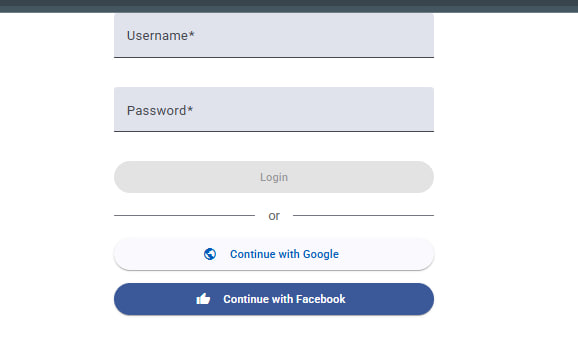
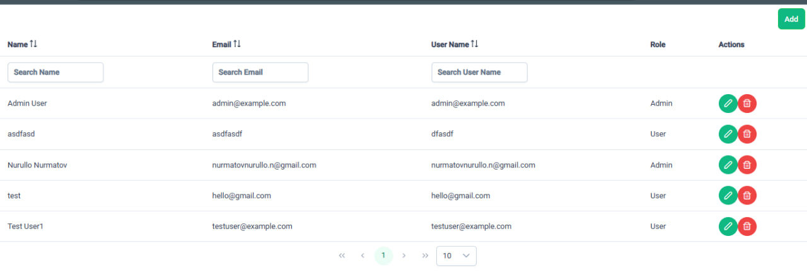
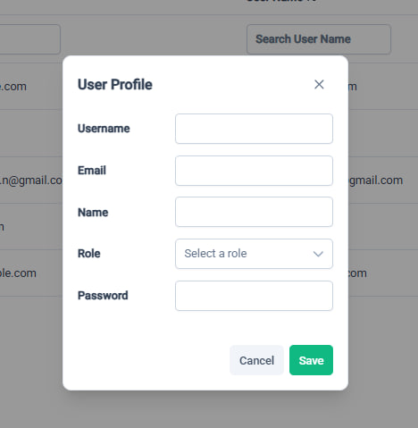

# User Management System

This project is a **User Management System** with authentication and user CRUD operations.  
The backend is built with **.NET Web API**, using **PostgreSQL, EF Core, and Identity Server**.  
The frontend is developed with **Angular, Tailwind CSS, and PrimeNG**.

## Features

### Backend API
- **Authentication & Authorization**
  - `POST /api/auth/register` - Register a new user
  - `POST /api/auth/login` - Login with username and password
  - `GET /api/auth/google-login` - Redirect to Google authentication
  - `GET /api/auth/signin-google` - Handle Google authentication
  - `GET /api/auth/facebook-login` - Redirect to Facebook authentication
  - `GET /api/auth/signin-facebook` - Handle Facebook authentication

- **User Management**
  - `POST /api/users` - Create a new user
  - `GET /api/users` - Get all users (with pagination, filtering, and search)
  - `GET /api/users/{id}` - Get a user by ID
  - `PUT /api/users/{id}` - Update user information
  - `DELETE /api/users/{id}` - Delete a user
  - `GET /api/users/roles` - Get available roles

### Frontend (Angular)
- **Authentication**
  - Login with **Username & Password**
  - Login with **Google** or **Facebook**
- **User Management**
  - List users with **pagination, search, and filtering**
  - Create, update, and delete users
  - Assign roles to users

## Screenshots

### Login Page


### User List


### User Modal


## Technologies Used

### Backend:
- .NET Web API
- EF Core
- PostgreSQL
- Identity Server

### Frontend:
- Angular
- Tailwind CSS
- PrimeNG

## Setup

1. **Clone the repository**  
   ```sh
   git clone https://github.com/yourusername/your-repo.git
   cd your-repo
